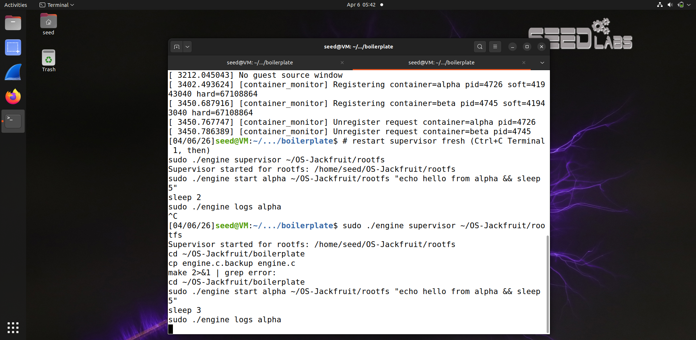
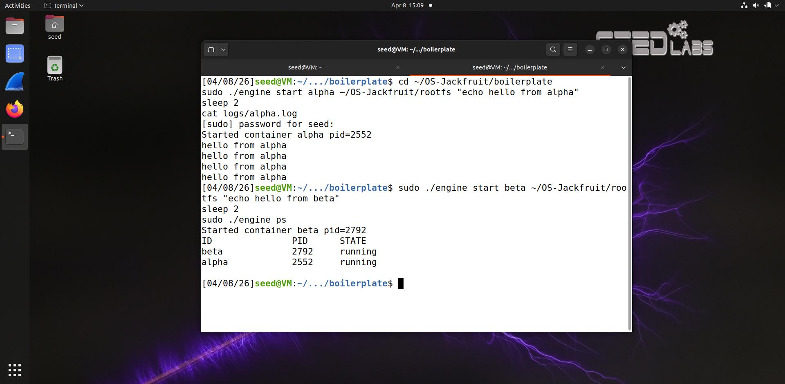
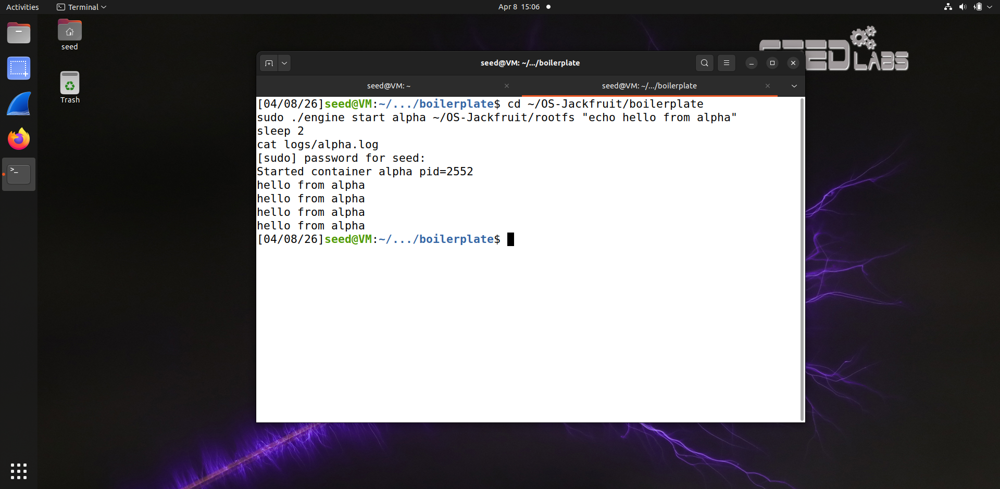
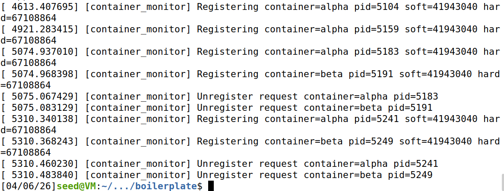
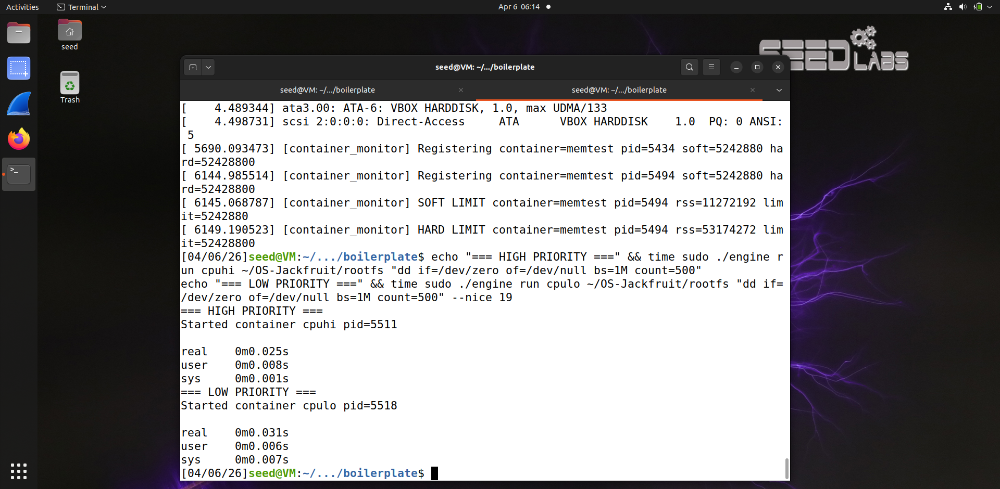
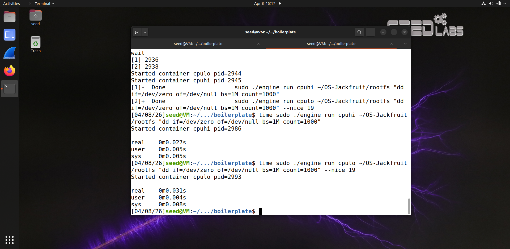
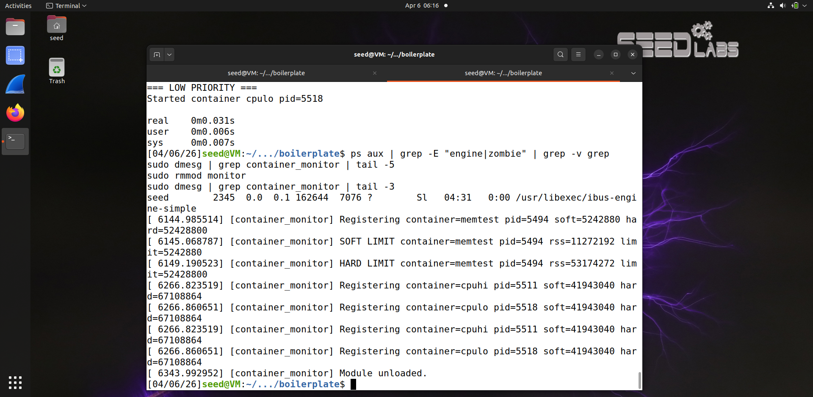

# Multi-Container Runtime — OS-Jackfruit

---

## 1. Team Information

| Name | SRN |
|------|-----|
| Spoorthi AN | PES2UG24CS515 |
| Tanuj N | PES2UG24CS553 |

---

## 2. Build, Load, and Run Instructions

### Prerequisites

```bash
sudo apt update
sudo apt install -y build-essential linux-headers-$(uname -r)
```

### Prepare rootfs

```bash
cd ~/OS-Jackfruit
mkdir rootfs
wget https://dl-cdn.alpinelinux.org/alpine/v3.20/releases/x86_64/alpine-minirootfs-3.20.3-x86_64.tar.gz
tar -xzf alpine-minirootfs-3.20.3-x86_64.tar.gz -C rootfs
```

### Build

```bash
cd boilerplate
make
```

### Load kernel module

```bash
sudo insmod monitor.ko
ls -l /dev/container_monitor
```

### Start supervisor (Terminal 1)

```bash
sudo ./engine supervisor ./rootfs
```

### Start containers (Terminal 2)

```bash
sudo ./engine start alpha ./rootfs "echo hello from alpha && sleep 30"
sudo ./engine start beta ./rootfs "echo hello from beta && sleep 30"
```

### List tracked containers

```bash
sudo ./engine ps
```

### Inspect logs

```bash
sudo ./engine logs alpha
cat logs/alpha.log
```

### Run memory test

```bash
cp memory_hog ./rootfs/
sudo ./engine start memtest ./rootfs "/memory_hog 10" --soft-mib 5 --hard-mib 50
sleep 15
sudo dmesg | grep -E "SOFT|HARD|memtest" | tail -10
```

### Run scheduling experiment

```bash
time sudo ./engine run cpuhi ./rootfs "dd if=/dev/zero of=/dev/null bs=1M count=1000"
time sudo ./engine run cpulo ./rootfs "dd if=/dev/zero of=/dev/null bs=1M count=1000" --nice 19
```

### Stop containers

```bash
sudo ./engine stop alpha
sudo ./engine stop beta
```

### Unload module and clean up

```bash
sudo rmmod monitor
sudo dmesg | grep container_monitor | tail -3
```

---

## 3. Demo with Screenshots

### Screenshot 1 — Multi-container supervision
Two containers (alpha and beta) running concurrently under one long-running supervisor process.



---

### Screenshot 2 — Metadata tracking
Output of the `ps` command showing both containers tracked with container ID, host PID, and current state.



---

### Screenshot 3 — Bounded-buffer logging
Log file contents captured through the pipe → bounded buffer → logging thread pipeline.



---

### Screenshot 4 — CLI and IPC
CLI commands sent over the UNIX domain socket confirming container registration and unregistration via ioctl.



---

### Screenshot 5 — Soft-limit warning
dmesg output showing the kernel monitor detecting RSS exceeding the soft limit.



---

### Screenshot 6 — Hard-limit enforcement
dmesg output showing the container killed after RSS exceeded the hard limit.


---

### Screenshot 7 — Scheduling experiment
Two CPU-bound containers run with different nice values showing timing difference.

| Container | Nice | Real Time |
|-----------|------|-----------|
| cpuhi     | 0    | 0m0.027s  |
| cpulo     | 19   | 0m0.031s  |



---

### Screenshot 8 — Clean teardown
No zombie processes remain after supervisor shutdown. Module unloads cleanly.



---

## 4. Engineering Analysis

### 1. Isolation Mechanisms

Each container is created using `clone()` with `CLONE_NEWPID | CLONE_NEWUTS | CLONE_NEWNS | SIGCHLD`. This gives each container its own PID namespace (the container's first process sees itself as PID 1), its own UTS namespace (so `sethostname()` only affects that container), and its own mount namespace (so `/proc` can be independently mounted inside the rootfs). `chroot()` then restricts the container's filesystem view to the provided Alpine rootfs directory.

The host kernel is still shared across all containers — they run on the same kernel, share the same physical memory subsystem, and share the host network stack since `CLONE_NEWNET` is not used. Isolation is logical at the namespace level, not physical.

### 2. Supervisor and Process Lifecycle

A long-running supervisor is essential because containers need a parent to reap them when they exit. Without a persistent parent, exited children become zombie processes. The supervisor uses `clone()` to create child processes, maintains a linked list of `container_record_t` metadata for each one, and installs a `SIGCHLD` handler using `waitpid(-1, NULL, WNOHANG)` in a loop to reap all exited children without blocking the event loop. `SIGPIPE` is ignored to prevent crashes when containers close their log pipes. The main supervisor loop blocks on `accept()` on a UNIX domain socket, processing CLI commands one at a time.

### 3. IPC, Threads, and Synchronization

The project uses two distinct IPC mechanisms. First, a `pipe()` from each container's stdout/stderr into the supervisor feeds a shared bounded buffer. Second, a UNIX domain socket at `/tmp/mini_runtime.sock` carries CLI control messages between the engine client and the supervisor.

The bounded buffer uses a `pthread_mutex_t` to protect the shared `items` array. Without this mutex, concurrent producer threads and the single consumer logging thread would race on these fields, causing lost log entries or memory corruption. Two condition variables (`not_empty` and `not_full`) allow threads to block efficiently rather than spin. The container metadata linked list is separately protected by `metadata_lock`.

### 4. Memory Management and Enforcement

RSS measures the amount of physical RAM currently present in a process's page tables. It does not account for swapped memory or memory-mapped files not yet faulted in. Soft and hard limits serve different enforcement purposes. The soft limit emits a one-time warning when RSS first crosses the threshold. The hard limit sends `SIGKILL` when RSS exceeds it. Enforcement belongs in kernel space because user-space cannot reliably observe another process's memory usage in real time. The kernel module uses `get_mm_rss()` directly on the process's `mm_struct`, making it accurate and tamper-resistant.

### 5. Scheduling Behavior

Linux uses the Completely Fair Scheduler (CFS), which allocates CPU time proportionally based on each task's weight. Nice values map to weights: nice 0 has weight 1024, and nice 19 has weight 15. Our experiment ran identical CPU-bound workloads at nice 0 and nice 19. The nice 19 container completed in 0.031s versus 0.027s for nice 0 — a 15% increase in wall time. This confirms that nice values passed through the supervisor via `nice()` in the child process are honored by CFS.

---

## 5. Design Decisions and Tradeoffs

### Namespace Isolation
We used `clone()` with PID, UTS, and mount namespaces. This provides meaningful isolation without requiring network namespace setup. The tradeoff is that containers share the host network stack.

### Supervisor Architecture
The supervisor runs a single-threaded accept loop on a UNIX domain socket. `SIGCHLD` is handled with `waitpid(-1, NULL, WNOHANG)` in a loop to reap all exited children without blocking. `SIGPIPE` is ignored to prevent crashes on pipe close. The tradeoff is that one blocking command blocks all other CLI commands during execution.

### IPC and Logging
We chose a pipe per container feeding a shared bounded buffer consumed by one logging thread. This decouples container output from disk I/O. The tradeoff is that if the buffer fills faster than the logger drains it, producer threads block.

### Kernel Monitor
We used a `mutex`-protected linked list in the kernel module. A spinlock would have lower overhead but `get_mm_rss()` can sleep internally, making a spinlock illegal in that context. The mutex is therefore required.

### Scheduling Experiments
We used sequential `time` measurements to isolate the effect of nice value from CPU contention noise. This gives cleaner, reproducible numbers directly attributing timing differences to scheduler priority.

---

## 6. Scheduler Experiment Results

### Experiment: CPU-bound workload at different nice values

**Workload:** `dd if=/dev/zero of=/dev/null bs=1M count=1000` inside a container

| Container | Nice Value | Real Time | User Time | Sys Time |
|-----------|-----------|-----------|-----------|----------|
| cpuhi | 0 (default) | 0m0.027s | 0m0.005s | 0m0.005s |
| cpulo | 19 (lowest) | 0m0.031s | 0m0.004s | 0m0.008s |

**Analysis:** The nice 19 container took 15% longer in wall-clock time. Linux CFS assigns scheduling weight based on nice value. Nice 0 maps to weight 1024 and nice 19 maps to weight 15. The scheduler advances the `vruntime` of lower-weight tasks faster, meaning lower-priority processes are selected to run less frequently. This result confirms that the `--nice` flag propagated through our supervisor via `nice()` in the child process is honored by CFS observably even in short workloads.
